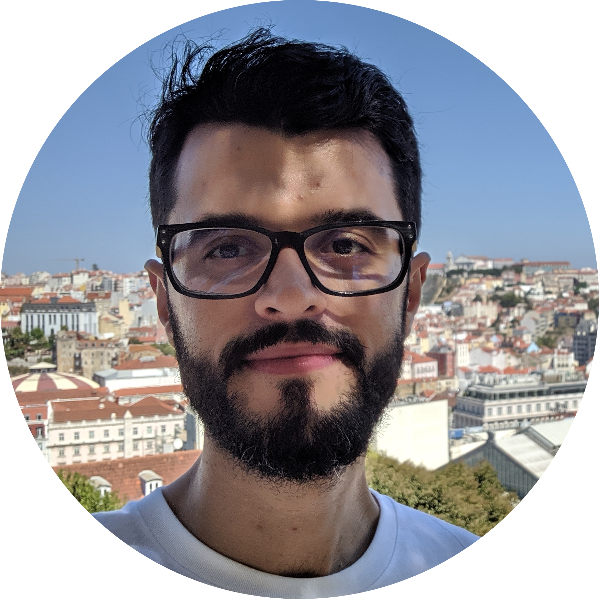

# Terry Ruas

<!-- Figure profile Terry  for github src="/truas/assets/img/tr_profile.png"-->
<figure>
   
</figure>

{: style="text-align: justify" }
Currently working as Postdoctoral Researcher at the [**DKE**](https://dke.uni-wuppertal.de/en.html) group with [Prof. Bela Gipp](https://dke.uni-wuppertal.de/de/people/prof-dr-bela-gipp.html) – Bergische Universität Wuppertal, Germany.

My research interest is the result of an overlap between natural language processing, data science, and machine learning applied to text mining to extract semantic features.

ruas **{at}** uni-wuppertal **{dot}** de

## **Research Interests**
- Natural Language Processing
    - Semantic feature extraction
    - Paraphrase Generation/Detection
    - Attention mechanisms
    - Fake News detection
- Data Science
- Word embeddings
    - Instability
- Scientometrics
- Recommender Systems
- Machine Learning

## **Experience**

### *Academia*
- **Bergische Universität Wuppertal** -  Wuppertal  (Germany)
    - (Current) Postdoctoral Researcher at [DKE](https://dke.uni-wuppertal.de/en.html) Group - [Prof. Bela Gipp](https://dke.uni-wuppertal.de/de/people/prof-dr-bela-gipp.html)
- **National Institute of Informatics** -  Tokyo (Japan)
    - Ph.D Research Internship (Jan – Jul 2018) - [Prof. Akiko Aizawa](https://www.nii.ac.jp/en/faculty/digital_content/aizawa_akiko/)

### *Industry*
- **IBM** - São Paulo (Brazil)
    - Cost Branding & Delivery Service Planner - Technical Support Services (TSS) (May 2014 –  July 2015).
    - Software Support Coordinator/Team Leader  – Application Integration Middleware, Open Systems, Power and Storage – (Aug 2012 – May 2014).
    - IT Specialist/Product Services – WebSphere Application Server, IBM HTTP Server, WebSphere Portal, WebSphere Content Management – (Oct 2010 – Aug 2012).
    - Trainee – IT Specialist/Product Services – WebSphere Application Server, IBM HTTP Server, WebSphere Portal, WebSphere Content Management – (Mar 2010 – Oct 2010).
    - Trainee – IT Specialist/Product Services – BlackBerry Enterprise Server Support – (Dec 2009-Mar 2010).

## **Education**
- **University of Michigan** -  Dearborn, MI (USA)
    - Ph.D. in Computer and Information Science (2019) - [Prof. William Grosky](https://umdearborn.edu/users/wgrosky)
- **Federal University of ABC (UFABC)** -  Santo Andre, SP (Brazil)
    - M.S. in Information Engineering (2013) - [Associate Professor Dra. Luciana Pereira](http://www.ufabc.edu.br/ensino/docentes/luciana-pereira)
    - B.S. in Computer Science (2010) - [Associate Professor Dra. Maria das Graças Bruno Marietto](http://lattes.cnpq.br/4466110931833988)
    - B.S. in Science and Technology (2010) 
       

